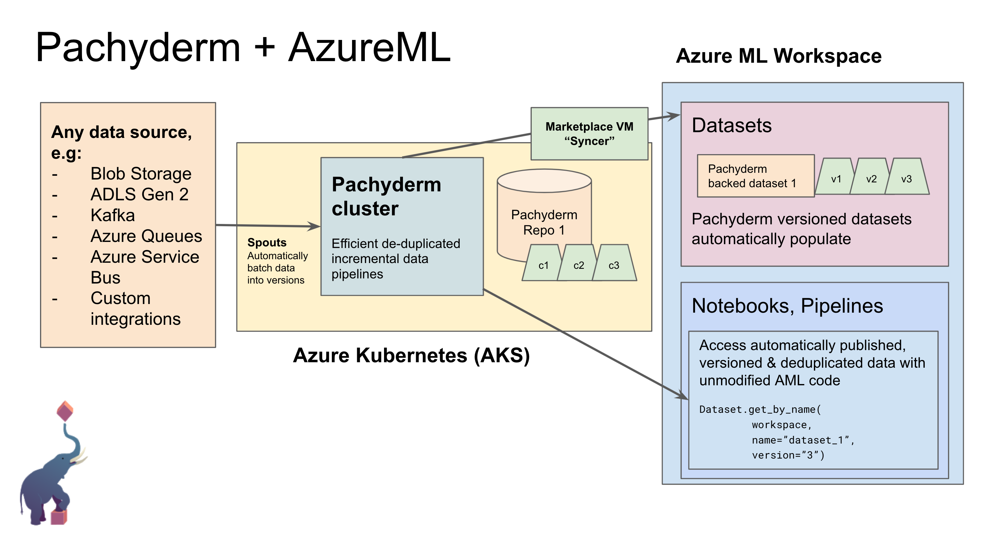

# Pachyderm-AzureML integration: Private Preview Instructions

**Please note: This repo should only be used by Pachyderm-approved private preview users. Please contact [joey@pachyderm.io](mailto:joey@pachyderm.io) to become a private preview user. This is a preview, do not use it for production!**

## Architecture



## Requirements

How to set up AML with Pachyderm:

* You need to be running Linux/MacOS/WSL on your local machine
* Install the [Azure CLI](https://docs.microsoft.com/en-us/cli/azure/install-azure-cli)
* Install [Terraform](https://learn.hashicorp.com/tutorials/terraform/install-cli)

## Step 1 - Deploy stack

Clone this repo.

```
git clone https://github.com/pachyderm/aml
```

```
cd aml
```

Log into Azure:
```
az login
```

Set up Terraform environment variables:
```
export TF_VAR_prefix="foo" # short descriptive name for your deployment
export TF_VAR_location="East US"
```

If you're deploying with an existing AzureML workspace, the location above must match.

Now we'll deploy the syncer VM and the AKS cluster and start Pachyderm on it.

### Option 1: Automatically create a new AzureML workspace and resource group:

```
bash scripts/setup.sh
```

### Option 2: Integrate Pachyderm with an existing AzureML workspace:

If you're attaching AzureML-Pachyderm to an existing AzureML workspace, specify the resource group that the target AzureML workspace is in here, as well as specifying the workspace name:

```
export TF_VAR_existing_resource_group_name="existing-resource-group"
export TF_VAR_existing_workspace_name="existing-workspace"
bash scripts/setup.sh
```

(You can also create a new AzureML workspace in an existing resource group by only specifying `TF_VAR_existing_resource_group_name` but not `TF_VAR_existing_workspace_name`.)


## Step 2 - Update rslex on your AML Compute

Note: this step will no longer be necessary after Microsoft release a new version of rslex.

From an AML notebook (create a new file in the "Notebooks" tab), connect to the compute instance you want to use with Pachyderm, and run:

```
!curl -sSL https://raw.githubusercontent.com/pachyderm/aml/main/scripts/install-rslex-pachyderm-beta.sh | sh
```

Now proceed with the demo...

## Demo video

TODO: insert link to youtube video here

## Tutorial

```
instance_ip="$(cd terraform; terraform output -raw instance_ip)"
ssh -t -o StrictHostKeyChecking=no -o UserKnownHostsFile=/dev/null ubuntu@$instance_ip -- '
    echo "{\"name\": \"Gilbert\", \"wins\": [[\"straight\", \"7♣\"], [\"one pair\", \"10♥\"]]}
{\"name\": \"Alexa\", \"wins\": [[\"two pair\", \"4♠\"], [\"two pair\", \"9♠\"]]}
{\"name\": \"May\", \"wins\": []}
{\"name\": \"Deloise\", \"wins\": [[\"three of a kind\", \"5♣\"]]}" > poker.jsonl
    pachctl create repo poker
    pachctl put file poker@master: -f poker.jsonl
'
```

Then click Consume and copy and paste the result into an AML notebook.

Then, run:
```
instance_ip="$(cd terraform; terraform output -raw instance_ip)"
ssh -t -o StrictHostKeyChecking=no -o UserKnownHostsFile=/dev/null ubuntu@$instance_ip -- '
    echo "{\"name\": \"Albert\", \"wins\": [[\"straight\", \"7♣\"], [\"one pair\", \"10♥\"]]}
{\"name\": \"Joey\", \"wins\": [[\"two pair\", \"4♠\"], [\"two pair\", \"9♠\"]]}
{\"name\": \"Luke\", \"wins\": []}
{\"name\": \"Alysha\", \"wins\": [[\"three of a kind\", \"5♣\"]]}" > poker.jsonl
    pachctl create repo poker
    pachctl put file poker@master: -f poker.jsonl
'
```

Now re-run the Consume code and show that it's updated, but then as the a-ha moment go back to the previous version and add `version="1"` to the Python code and show that you see the old version of the data - a-ha! Data versioning & reproducibility!
